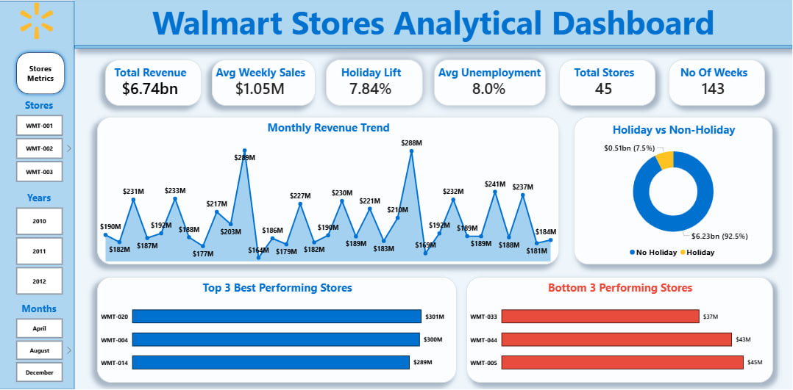
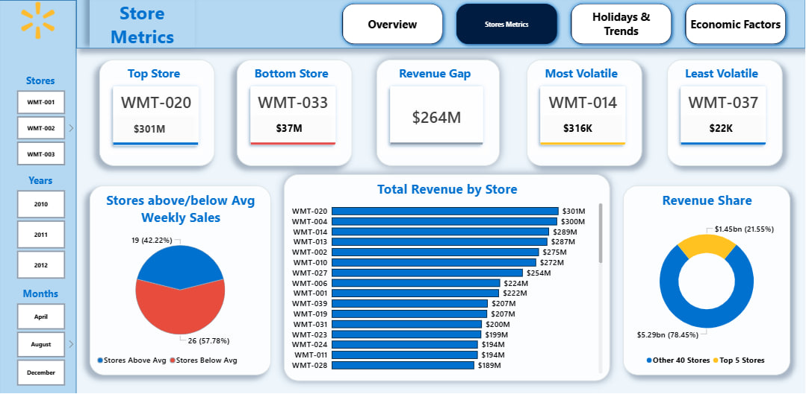
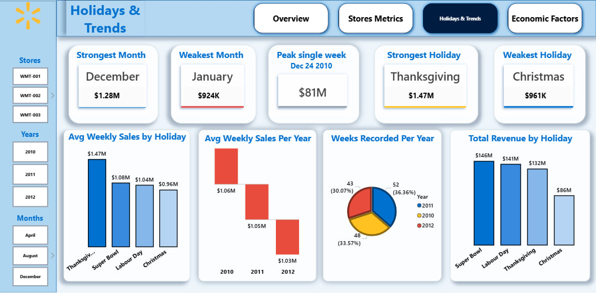
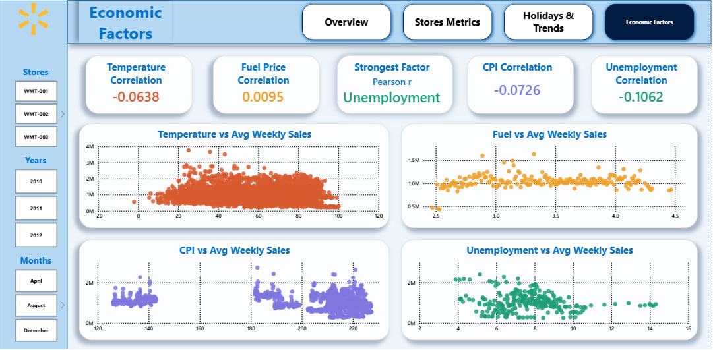

# Walmart Stores Sales Performance Analysis

> **A full end-to-end data analysis of 45 Walmart stores across the United States, covering weekly sales performance, holiday markdown events, and external economic drivers from February 2010 to October 2012.**

---

## Project Overview

This project analyses **weekly sales data for 45 Walmart stores** located across different regions of the United States. The analysis spans three analytical phases — **Excel data cleaning**, **SQL exploratory analysis (67 questions across 10 categories)**, and a **4-page Power BI dashboard** — to understand what drives store performance, how holiday markdown events affect sales, and whether external economic factors (temperature, fuel price, CPI, unemployment) meaningfully influence consumer spending at Walmart.

The project was completed as part of a professional portfolio development initiative, following the complete workflow of a real-world data analyst.

---

## Business Context

Walmart runs several promotional markdown events throughout the year. These markdowns precede four major holiday events: **Super Bowl**, **Labour Day**, **Thanksgiving**, and **Christmas**. Weeks including these holidays are weighted five times higher in Walmart's internal performance evaluation than non-holiday weeks.

**Business questions driving this analysis:**
- Which stores are the strongest and weakest performers — and by how much?
- Do holiday markdown events actually drive significantly higher sales?
- Is the network growing, declining, or holding steady across the period?
- Which external economic factor has the most meaningful relationship with weekly sales?
- Which stores defy expectations — strong performance despite adverse conditions, or weak performance despite favourable ones?

---

## Dashboard Preview

### Page 1 — Executive Overview

### Page 2 — Store Metrics

### Page 3 — Holidays & Trends

### Page 4 — Economic Factors

---

## Key Findings

### Overall Performance

- **Total network revenue:** $6.74 billion across 45 stores over 143 weeks per store
- **Average weekly sales:** $1,046,964 per store per week
- **Peak single week (all stores combined):** $80.9 million — week of December 24, 2010
- **Average weekly sales declined every year:** $1,059,669 (2010) → $1,046,239 (2011) → $1,033,660 (2012), despite improving economic conditions

### Store Performance

- **Top store:** WMT-020 — $301.4 million total revenue, $2.1 million average per week
- **Bottom store:** WMT-033 — $37.2 million total revenue, $259,861 average per week
- **Revenue gap between best and worst store:** $264.2 million
- **19 stores** perform above the network average; **26 stores** below
- **Top 5 stores** generate **21.6%** of total network revenue; bottom 5 generate only **3.5%**
- **Most volatile store:** WMT-014 (standard deviation: $317,570/week)
- **Most stable store:** WMT-037 (standard deviation: $21,837/week)

### Holiday & Markdown Analysis

- Holiday weeks outperform non-holiday weeks by only **+7.84%** — a surprisingly modest uplift for events weighted 5× in internal evaluation
- Holiday weeks account for just **7.5% of total revenue** ($505M of $6.74B)
- **Strongest holiday by average weekly sales:** Thanksgiving ($1.47M per store per week)
- **Weakest holiday by average weekly sales:** Christmas ($960,833) — sits below the overall network average
- **Christmas paradox:** The flagged Christmas holiday week is the weakest of all four holiday events, yet December is the strongest month in the calendar. The explanation is demand pull-forward — customers complete their Christmas shopping in the weeks before the holiday, particularly the week of December 24, which is flagged as Non-Holiday but recorded the highest combined weekly sales in the entire dataset at $80.9M across all 45 stores

>  **Insight:** Walmart's promotional markdown events are designed to precede the holidays, successfully pulling consumer spending forward into the pre-holiday window. The flagged holiday week captures the tail of the promotional cycle, not the peak — which is why the pre-Christmas Non-Holiday week consistently outperforms the Christmas week itself.

### Year-Over-Year Trend

- 2011 had the highest total revenue ($2.45B) but this reflects a complete 52-week year vs 2010's 48 weeks (data starts February) and 2012's 43 weeks (data ends October)
- On a fair per-week basis, **sales declined every single year** without exception
- This decline occurred **alongside falling unemployment** (8.49% in 2010 → 7.35% in 2012), meaning economic recovery did not translate into increased Walmart spending — a counterintuitive finding suggesting that as household finances improved, some customers migrated away from value retail

### Economic Factors

All four external factors show **extremely weak correlations** with weekly sales:

| Factor | Pearson r | Direction |
|---|---|---|
| Unemployment | −0.1062 | Weak negative |
| CPI | −0.0726 | Weak negative |
| Temperature | −0.0638 | Weak negative |
| Fuel Price | +0.0095 | Essentially zero |

- **Unemployment** is the strongest factor — barely. An r of −0.11 means unemployment explains approximately 1.1% of the variation in weekly sales
- **Fuel price** has virtually no relationship with sales within the $2.47–$4.47 range observed in this dataset
- **CPI**: The 45 stores are split into two distinct market clusters — 22 stores at CPI ≈ 128–140 (lower cost-of-living markets) and 23 stores at CPI ≈ 186–227 (higher cost-of-living markets), with no overlap in between

>  **Key conclusion:** External economic conditions explain very little of the performance variation across Walmart's store network. Internal factors — store size, geographic market size, local competition, and operational management — are almost certainly the primary drivers of the $264M revenue gap between top and bottom stores.

### Stores Defying Expectations

- **WMT-020** (top performer at $2.1M/week) operates under the 4th worst combined external conditions in the network (high unemployment + high CPI + elevated fuel prices) — yet is the best-performing store on every metric
- **WMT-044** (2nd worst performer at $302K/week) operates in near-ideal external conditions (low unemployment, low CPI, low fuel) — yet generates barely 14% of WMT-020's weekly revenue
- Three stores — WMT-012, WMT-028, and WMT-038 — share identical adverse conditions (13.1% unemployment, CPI 128.68, $3.61 fuel) but generate $1.01M, $1.32M, and $386K per week respectively — a 3.4× performance gap in the same external environment

---

## Data Limitations & Caveats

| Limitation | Impact |
|---|---|
| **2010 data starts February 5** — January is missing | 2010 has 48 weeks, not 52. Raw 2010 totals are not directly comparable to 2011. All YoY comparisons use average weekly sales, not totals. |
| **2012 data ends October 26** — November and December are missing | 2012 has 43 weeks. Q4 2012 contains only October data. Quarter-level year-over-year comparisons involving Q4 2012 were excluded from the analysis. |
| **Thanksgiving and Christmas 2012 are absent** | Only 2 years of data exist for these holidays (vs 3 for Super Bowl and Labour Day). Holiday averages have unequal sample sizes. |
| **No store size, location, or format data** | The dataset does not identify store type, square footage, or geographic region. The large performance gap between stores cannot be attributed to any specific structural cause from this dataset alone. |
| **No promotion or markdown amount data** | The dataset flags holiday weeks but does not provide the actual markdown depth, promotional spend, or category-level data. The causal effect of markdowns on sales cannot be directly measured. |
| **Correlations are row-level** | Pearson correlations were calculated at the individual week-store row level (6,435 rows). Results reflect overall association across the full dataset, not causal relationships. |

---

## How to Use This Project

**To explore the SQL queries:**
1. Open SSMS and connect to a SQL Server instance
2. Create a new database: `CREATE DATABASE WalmartDB;`
3. Import `Walmart Cleaned.xlsx` using the SQL Server Import Wizard
4. Open `Walmart_SQLQuery.sql` and run any query against the `WalmartDB` database

**To explore the Power BI dashboard:**
1. Download and open `Walmart Sales.pbix` in Power BI Desktop (free download at powerbi.microsoft.com)
2. Use the Store slicer on the left to filter by specific stores
3. Use the Years and Months slicers to filter by time period
4. Navigate across the four pages using the button tabs at the top

**To explore the cleaned data:**
1. Open `Walmart Cleaned.xlsx` in Microsoft Excel
2. The `Walmart Data` sheet contains the full cleaned and enriched dataset
3. All derived columns (Store_ID, Holiday_Name, Year, Month, Quarter, etc.) are already present

---

## About the Author

**Emeka Victor Prince**
Junior Data Analyst | Co-Lead, Plasma Africa

This project is part of a structured 20-project professional portfolio covering Sales & Revenue Analytics, Healthcare Analytics, HR & Workforce Analytics, Finance & Investment Analytics, and Supply Chain & Operations Analytics — built end-to-end using Excel, Power Query, SQL Server, and Power BI.

---

*Analysis period: February 2010 – October 2012 | Dataset: 45 Walmart stores | 6,435 weekly records*
